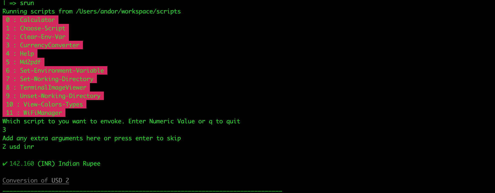

# Script Runner (S-run) 
## A Simple Utility for Script Management ### 

To use: 

Step 1: Run the init/setup.sh script first. 
Step 2: Usage: Type `srun` in terminal



Some tools available:
* A semi-persistent enviornmental varaible exporter
* Quick access to a "Main" or "Working directory"
* A color viewer
* A currency converter
* Easy access to BCal
* Terminal Image Viewer 
* WiFi Manager

Note: This is mostly a wrapper and facilitator toward these packages. Most of the packages and libraries themselves were not written for this project. 

Depedencies: 
* osx-wifi-manager
* bcal
* timg
* cash

## Sample Commands/Tools

### Epoch Converter

```
Running scripts from /Users/andor/workspace/scripts
 0 : Backup-Computer
 1 : Calculator
 2 : Choose-Script
 3 : Clear-Env-Var
 4 : CreateNetworkProfile
 5 : CurrencyConverter
 6 : EpochConverter
 7 : Help
 8 : JoinNetwork
 9 : Md2pdf
 10 : Set-Environment-Variable
 11 : Set-Working-Directory
 12 : StopWatch
 13 : TerminalImageViewer
 14 : Timer
 15 : Unset-Working-Directory
 16 : View-Colors-Types
 17 : View-WorldTime
 18 : WeatherReport
 19 : WiFiManager
 20 : WiFiManager2
Which script to you want to envoke. Enter Numeric Value or q to quit
6
Add any extra arguments here or press enter to skip
1573031787
1573031787 is 2019-11-06T09:16:27.000000Z assuming seconds
```

### Terminal Image Viewer

```
| => srun
Running scripts from /Users/andor/workspace/scripts
 0 : Backup-Computer
 1 : Calculator
 2 : Choose-Script
 3 : Clear-Env-Var
 4 : CreateNetworkProfile
 5 : CurrencyConverter
 6 : EpochConverter
 7 : Help
 8 : JoinNetwork
 9 : Md2pdf
 10 : Set-Environment-Variable
 11 : Set-Working-Directory
 12 : StopWatch
 13 : TerminalImageViewer
 14 : Timer
 15 : Unset-Working-Directory
 16 : View-Colors-Types
 17 : View-WorldTime
 18 : WeatherReport
 19 : WiFiManager
 20 : WiFiManager2
Which script to you want to envoke. Enter Numeric Value or q to quit
13
Add any extra arguments here or press enter to skip
sample.jpg
```
This will show the image in terminal.

### StopWatch
```
| => srun
Running scripts from /Users/andor/workspace/scripts
 0 : Backup-Computer
 1 : Calculator
 2 : Choose-Script
 3 : Clear-Env-Var
 4 : CreateNetworkProfile
 5 : CurrencyConverter
 6 : EpochConverter
 7 : Help
 8 : JoinNetwork
 9 : Md2pdf
 10 : Set-Environment-Variable
 11 : Set-Working-Directory
 12 : StopWatch
 13 : TerminalImageViewer
 14 : Timer
 15 : Unset-Working-Directory
 16 : View-Colors-Types
 17 : View-WorldTime
 18 : WeatherReport
 19 : WiFiManager
 20 : WiFiManager2
Which script to you want to envoke. Enter Numeric Value or q to quit
12
Add any extra arguments here or press enter to skip

No extra arguments chosen. Continuing...
Starting stopwatch. Press enter to stop
 ---- 4.697105 seconds
 ```
 
 ### Weather Report
 ```
 | => srun
Running scripts from /Users/andor/workspace/scripts
 0 : Backup-Computer
 1 : Calculator
 2 : Choose-Script
 3 : Clear-Env-Var
 4 : CreateNetworkProfile
 5 : CurrencyConverter
 6 : EpochConverter
 7 : Help
 8 : JoinNetwork
 9 : Md2pdf
 10 : Set-Environment-Variable
 11 : Set-Working-Directory
 12 : StopWatch
 13 : TerminalImageViewer
 14 : Timer
 15 : Unset-Working-Directory
 16 : View-Colors-Types
 17 : View-WorldTime
 18 : WeatherReport
 19 : WiFiManager
 20 : WiFiManager2
Which script to you want to envoke. Enter Numeric Value or q to quit
18
Add any extra arguments here or press enter to skip
Los Angeles

 ------------------------------------------------
                WEATHER REPORT
 ------------------------------------------------
Los Angeles, USA
Condition: Clear
Temperature: 13.07°C
San Francisco, USA
Condition: Clouds
Temperature: 10.82°C


   ╭────────────────────────────────────────╮
   │                                        │
   │    Update available 1.3.2 → 1.5.0      │
   │   Run npm i -g weather-cli to update   │
   │                                        │
   ╰────────────────────────────────────────╯

Delhi, Indi
Condition: Haze
Temperature: 30°C
 ------------------------------------------------
 ```
 
 ### Get WiFi Password
 ```
 | => srun
Running scripts from /Users/andor/workspace/scripts
 0 : Backup-Computer
 1 : Calculator
 2 : Choose-Script
 3 : Clear-Env-Var
 4 : CreateNetworkProfile
 5 : CurrencyConverter
 6 : EpochConverter
 7 : Help
 8 : JoinNetwork
 9 : Md2pdf
 10 : Set-Environment-Variable
 11 : Set-Working-Directory
 12 : StopWatch
 13 : TerminalImageViewer
 14 : Timer
 15 : Unset-Working-Directory
 16 : View-Colors-Types
 17 : View-WorldTime
 18 : WeatherReport
 19 : WiFiManager
 20 : WiFiManager2
Which script to you want to envoke. Enter Numeric Value or q to quit
19
Add any extra arguments here or press enter to skip
pass
****************
```
And many more....

 
 

